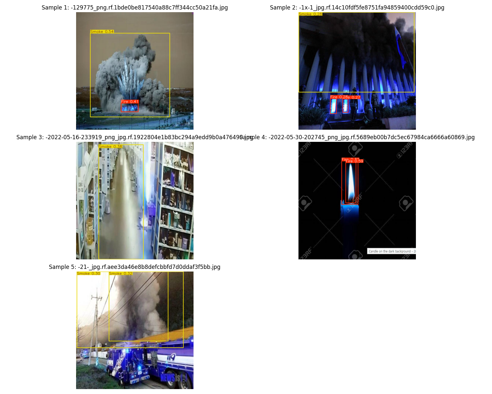

# 🔥 YOLO v11 Fire and Smoke Detector

## Project Overview

This project implements a real-time fire and smoke detection system using YOLOv11 (You Only Look Once) object detection architecture. The model is trained on a custom dataset of fire and smoke images to provide accurate detection for safety monitoring applications.



## Features

- **Multi-class Detection**: Detects both fire and smoke in images and videos
- **Real-time Processing**: Optimized for fast inference on various hardware
- **Multiple Input Sources**:
  - Static image analysis
  - Video file processing
  - Real-time webcam detection
- **User-friendly Interface**: Built with Streamlit for easy interaction

## Project Structure

```
├── app.py                   # Streamlit web application for testing
├── training.ipynb           # Jupyter notebook for model training
├── models/                  # Trained models and results
│   └── fire_smoke_detector/ # Training outputs and visualizations
│       ├── weights/         # Model weights (best.pt, last.pt)
│       └── results.png      # Training metrics visualization
├── Final_Data_After_cleaning/ # Dataset
│   ├── data.yaml            # Dataset configuration
│   ├── train/               # Training images & labels
│   ├── valid/               # Validation images & labels
│   └── test/                # Testing images & labels
```

## Model Training

The model was trained using [Ultralytics YOLOv11](https://github.com/ultralytics/ultralytics), a state-of-the-art object detection framework. The training process involved:

1. Dataset preparation with fire and smoke annotations
2. Model initialization with pre-trained weights
3. Training with optimized hyperparameters
4. Model validation and performance evaluation

Key training parameters:

- Architecture: YOLOv11
- Image size: 640×640
- Batch size: 8
- Training epochs: 100
- Early stopping patience: 20

The trained model has been exported to multiple formats:

- PyTorch (.pt) - Native format
- ONNX (.onnx) - Cross-platform deployment
- TensorFlow.js - Web browser deployment

## Installation

1. Clone this repository
2. Install dependencies:

```bash
pip install -r requirements.txt
```

The core requirements include:

- ultralytics
- streamlit
- opencv-python
- torch
- pillow
- matplotlib

## Usage

### Model Training

To train or fine-tune the model:

```bash
jupyter notebook training.ipynb
```

The notebook contains step-by-step instructions for training, validation, and exporting the model.

### Detection Application

Run the Streamlit application:

```bash
streamlit run app.py
```

The application provides three main functionalities:

- **Image Detection**: Upload and analyze static images
- **Video Detection**: Process pre-recorded videos
- **Webcam Detection**: Real-time detection using your webcam

## Results

The model achieves high accuracy in detecting fire and smoke in various conditions. Performance metrics include:

- mAP (mean Average Precision)
- Precision
- Recall
- F1-Score

Visualization of these metrics can be found in `models/fire_smoke_detector/results.png`.

## Future Improvements

- Integration with alarm systems
- Deployment on edge devices
- Adding smoke density estimation
- Mobile application development
- Web application using TensorFlow.js

## Acknowledgments

- Dataset: Fire and smoke images collected and annotated from various sources
- YOLOv11: Based on the Ultralytics YOLOv8 implementation
- Training infrastructure: Optimized for both CPU and GPU environments

## License

This project is licensed under the MIT License - see the LICENSE file for details.

---

Developed by [Your Name] for fire safety applications
